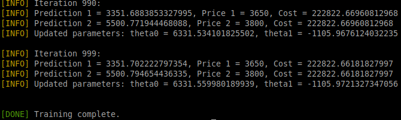
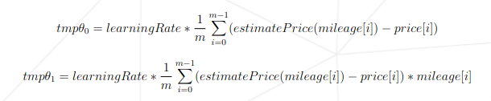
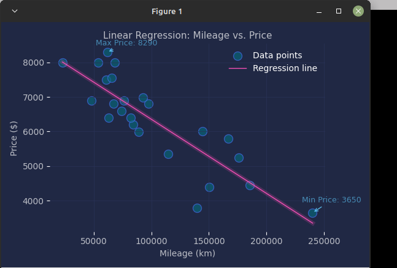
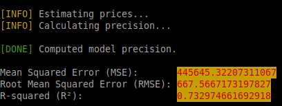

# ft_linear_regression

## Linear Regression
Linear regression is a fundamental statistical method used to model the relationship between a dependent variable and one or more independent variables. It assumes that there is a linear relationship between the input features and the output target. This technique is widely used in various fields, including economics, biology, engineering, and social sciences, for predictive modeling and data analysis.

### Key Concepts
* Dependent Variable (Target): The variable we are trying to predict or explain (e.g., house prices).

* Independent Variables (Features): The variables used to predict the dependent variable (e.g., square footage, number of bedrooms).

* Linear Relationship: The relationship is represented by a linear equation of the form:<br />
  `y = b0 + b1x1 + b2x2 + ... + bnxn + ϵ`
    
    Where:<br />
        - y is the predicted value.<br />
        - b0 is the y-intercept.<br />
        - b1, b2, ..., bn are the coefficients for each independent variable.<br />
        - x1, x2, ..., xn are the independent variables.<br />
        - ϵ is the error term.

## Description
This project implements a simple linear regression with a single feature.<br />

To do so, we have <i><b>four programs</b></i> :<br />
### ***1. model_prediction.py***
The first program will be used to predict the target value for a given feature value.<br />
* When you launch the program, it should prompt you for an X value (eg. the mileage of a car), and then give you back the estimated y value (eg. the price of the car) for that X value. The program will use the following
hypothesis to predict the y value :<br />

`estimateY(X) = θ0 + (θ1 * X)`<br />

* Before the run of the training program, theta0 and theta1 will be set to 0.<br />
- screenshot:


### ***2. model_training.py***
The second program will be used to train the model. It will read the dataset file
and perform a linear regression on the data.<br />
* Once the linear regression has completed, the variables theta0 and theta1 will be saved in an external file for use in the first program.<br />

* We will be using the following formulas:


### ***3. plot_regression.py***
The third program will plot the data and the regression line on a graph using the matplotlib library. It will be displayed on an external window. It is a great way to visualize how well the model fits the data.<br />
* screenshot:


### The fourth program will calculate the precision of the model
* screenshot:


## Requirements
* Some version of python
* Tkinter for python
```
// Install Tkinter (for Ubuntu/Linux)
sudo apt-get update
sudo apt-get install python3-tk
```

## Commands
```
// Set up the environment
make

// Launch the training
make re
or
make train
or
python model_training.py

// Make a prediction
make estimate
or
python estimate.py

// Plotting the data and the regression line on a graph.
make plot
or
python plot_regression.py

// Calculate the precision of the model
make precision
or
python model_precision.py

```

## Datasets
We have two dataset available in the 'data' folder:
* `data_income_intel.csv`: intelligence related to income<br />
The IQ presented was formed from the results of numerous international studies and compared the average income from 2000 to 2019.<br >
(Data from https://www.worlddata.info/iq-by-country.php)

* `data_mileage_price.csv`: mileage of a car related to its price

## Model precision
### Mean Squared Error (MSE)
 - MSE is the average of the squared differences between predicted and actual values.
 - Lower MSE indicates better model performance.
 - The unit of MSE is the square of the target variable (e.g., square of price).

### Root Mean Squared Error (RMSE)
 - RMSE is the square root of MSE, making it easier to interpret because
  it has the same unit as the target variable (e.g., price in dollars).
 - An RMSE of 667.57 means that, on average, the model's predictions
  are off by about 667.57 units.
 - Whether this is "good" depends on the range and scale of your target variable.
 - For example:
    - If car prices in the dataset range between $3,000 and $8,000, an error of $667 is ~10% of the range, which might be acceptable.
    - If prices are closer together (e.g., $5,000-$6,000), this error may be too high.

### R-squared (R²)
 - R² measures how well the model explains the variance in the data.
 - A value of 0.733 means the model explains 73.3% of the variability in the target variable.
 - R² ranges from 0 to 1:
    - 1 indicates a perfect model.
    - 0 means the model does no better than simply predicting the mean of the target.

 - For many real-world problems, an R2R2 value above 0.7 is considered "good",
   but this depends on the field:
    - In social sciences, even 0.3 might be acceptable.
    - In physical sciences, models often achieve R² > 0.9.
